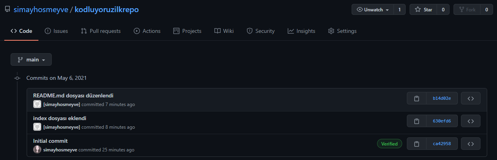

# Kodluyoruz Frontend 101 Alıştırmaları

Bu repo [Kodluyoruz](https://www.kodluyoruz.org) Front-End Eğitimi sırasında oluşturulmuştur.



## Installation

Öncelikle projeyi clonelayın.

```bash
git clone https://github.com/simayhosmeyve/Kodluyoruz-Frontend-101-Alistirmalari.git
```

## Usage

Projeyi cloneladıktan sonra Visual Studio Code programında açınız.

Linux için:
```linux
cd Kodluyoruz-Frontend-101-Alistirmalari
code .
```

## Contributing
Pull requestler kabul edilir. Büyük değişiklikler için, lütfen önce neyi değiştirmek istediğinizi tartışmak için bir konu açınız.


## License
[MIT](https://choosealicense.com/licenses/mit/)
